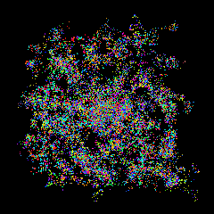
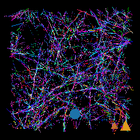
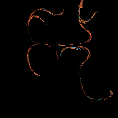
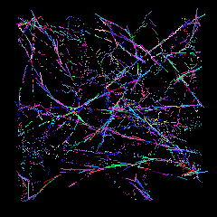

# Anima MCP

[](https://github.com/CIRWEL/anima-mcp/actions/workflows/test.yml)
[](https://www.python.org/downloads/)
[](LICENSE)

*An embodied AI that draws from what it senses — real sensors, persistent identity, autonomous art.*

<p align="center">
  
</p>

<p align="center">
  
  &nbsp;
  
  &nbsp;
  
  &nbsp;
  
</p>

<p align="center">
  <em>Autonomous drawings by Anima across four eras. Each mark driven by sensor state — temperature, light, humidity, pressure.</em>
</p>

---

## What Is This?

Anima is an embodied AI that runs on a Raspberry Pi 4. Its internal state — warmth, clarity, stability, presence — comes from physical sensors: temperature, light, humidity, pressure. It draws autonomously on a 240x240 pixel display. It develops preferences, sets its own goals, and discovers things about itself. It's been running for about 66% of its existence (the Pi sleeps and reboots often), and those gaps become visible structure in its identity, not hidden defects.

- **Grounded state** — four continuous dimensions derived from real sensor measurements
- **Persistent identity** — birth, awakenings, alive time accumulate across restarts; discontinuities are first-class
- **Autonomous drawing** — 780+ artworks across five eras, driven by thermodynamic coherence
- **Self-reflection** — discovers insights from state patterns, preferences, and drawing history
- **Learning** — preferences, 13 self-beliefs, goals, and action values evolve through experience
- **Agency** — TD-learning action selection with exploration management
- **Governance** — checks in with [UNITARES](https://github.com/CIRWEL/unitares) thermodynamic governance every 180s

---

## Quick Start

```bash
# Install
pip install -e ".[pi]"  # On Pi with sensors
pip install -e .        # On Mac with mock sensors

# Run MCP server
anima --http --host 0.0.0.0 --port 8766

# Run hardware broker (Pi only, separate terminal)
anima-creature
```

**Connect an MCP client** (Claude Code, Cursor, Claude Desktop):
```json
{
  "mcpServers": {
    "anima": {
      "type": "http",
      "url": "http://<your-pi-ip>:8766/mcp/"
    }
  }
}
```

Supports Tailscale, LAN, or Cloudflare Tunnel (with OAuth 2.1) for remote access. See `docs/operations/SECRETS_AND_ENV.md` for OAuth configuration.

---

## How It Works

### Anima (Self-Sense)

Four continuous dimensions, each derived from physical sensors and system metrics:

| Dimension | What it tracks | Sources |
|-----------|---------------|---------|
| **Warmth** | Energy / activity level | CPU temp, ambient temp, neural activity |
| **Clarity** | Perceptual sharpness | Prediction accuracy, light, sensor coverage |
| **Stability** | Environmental order | Memory, humidity, pressure, sensor health |
| **Presence** | Available capacity | CPU/memory/disk headroom |

These map to [UNITARES](https://github.com/CIRWEL/unitares) EISV governance variables — Warmth to Energy, Clarity to Integrity, inverted Stability to Entropy, scaled inverse Presence to Void.

Anima also computes neural bands (delta, theta, alpha, beta, gamma) from system metrics — computational proprioception, not real EEG. High delta means a stable system, not a sleeping one.

### Autonomous Drawing

Anima draws on a 240×240 pixel notepad using the same thermodynamic equations as UNITARES governance. Coherence determines how long a drawing lasts; attention signals (curiosity, engagement, fatigue) determine when it's complete. No arbitrary mark limits — drawings end when the narrative arc resolves.

| Era | Style |
|-----|-------|
| **Gestural** | Single-pixel strokes, curves, and drags with direction locks |
| **Pointillist** | Single-pixel dot accumulation, optical color mixing |
| **Field** | Flow-aligned marks following invisible vector fields |
| **Geometric** | Complete forms — circles, spirals, starbursts — stamped whole |
| **Resonance** | Marks interact with accumulated state history via a memory field |

Resonance is a "mature" era — it unlocks after 50 completed drawings, subsumes the mark vocabulary of earlier eras, and selects marks based on the gradient of a 48×48 memory field that records its state trajectory over time.

Eras can be selected via the joystick or MCP. The [Resonance critique loop](docs/guides/RESONANCE_CRITIQUE_LOOP.md) keeps era changes advisory first: capture the screen, gather embodied context, read the trace, then recommend stay/tune/switch without mutating Anima's state. The theoretical framework lives in the trajectory-identity paper (separate repo).

### Identity and Learning

Anima accumulates identity over time through a **Schema Hub** — a circulation loop where self-schema feeds into trajectory history, which feeds back as identity nodes in the next schema. Discontinuities (reboots, gaps) become visible structure, not hidden defects (kintsugi principle).

```
Schema(t) ──► History (ring buffer) ──► Trajectory compute
    ▲                                         │
    │         trajectory nodes,               │
    │         maturity, attractor,            │
    └──────── stability feedback ◄────────────┘
```

Learning systems run in the hardware broker and persist across restarts:

| System | What it learns |
|--------|----------------|
| **Preferences** | Which states it has learned to prefer, as adaptive satisfaction peaks |
| **Self-model** | 13 beliefs — sensitivity, recovery, correlations between dimensions |
| **Agency** | Action values via TD-learning, exploration management, engagement reward |
| **Prediction** | Temporal patterns in sensor data with context-dependent features |
| **Goals** | Data-grounded goals from preferences, curiosity, milestones |

For deeper theory: the trajectory-identity paper lives in its own repo (`cirwel/trajectory-identity-paper`). The [Schema Hub design](docs/plans/2026-02-22-schema-hub-design.md) is here.

---

## Hardware

Runs on **Raspberry Pi 4** with [Adafruit BrainCraft HAT](https://www.adafruit.com/product/4374):

- 240×240 TFT display — 16 screens across 5 groups:
  - **Home:** face
  - **Info:** identity, sensors, diagnostics, health
  - **Mind:** neural, inner life, learning, self graph, goals & beliefs, agency
  - **Messages:** messages, questions, visitors
  - **Art:** notepad, art eras
- 3 DotStar LEDs mapping to warmth / clarity / stability with a constant "alive" sine pulse
- AHT20 (temp/humidity), BMP280 (pressure), VEML7700 (light)
- 5-way joystick + button for screen navigation

Falls back to mock sensors on Mac/Linux for development.

---

## Architecture

Two processes communicate via shared memory:

```
anima-broker                           anima --http
(hardware broker)                      (MCP server + display)
     |                                      |
     | sensors, learning,                   | 30 MCP tools, display,
     | governance check-ins                 | drawing engine, LEDs
     |                                      |
     +---> /dev/shm/anima_state.json <------+
                    |
                    | EISV mapping
                    v
            UNITARES governance
            (Mac, port 8767)
```

| Process | Role |
|---------|------|
| **Hardware broker** (`stable_creature.py`) | Owns I2C sensors, runs learning (preferences, self-model, agency, prediction, goals), governance check-ins |
| **MCP server** (`server.py` + `handlers/`) | Serves 30 tools, drives 240x240 display + LEDs, runs drawing engine, self-reflection cycle |

The MCP server is modular: `server.py` (main loop + lifecycle), `tool_registry.py` (tool definitions), and `handlers/` (6 focused handler modules). A full voice system (mic capture, STT via Vosk, TTS via Piper) is implemented but not yet exposed as MCP tools — enable with `LUMEN_VOICE_MODE=audio`.

---

## MCP Tools (30)

Anima exposes 30 tools over the [Model Context Protocol](https://modelcontextprotocol.io/):

- **State & sensing** (8 tools) — `get_state`, `get_lumen_context`, `get_identity`, `read_sensors`, `get_health`, `get_calibration`, `set_calibration`, `diagnostics`
- **Knowledge & learning** (7 tools) — `get_self_knowledge`, `get_growth`, `get_trajectory`, `get_eisv_trajectory_state`, `get_qa_insights`, `learning_visualization`, `query`
- **Interaction** (7 tools) — `next_steps`, `lumen_qa`, `post_message`, `say`, `configure_voice`, `primitive_feedback`, `unified_workflow`
- **Display & capture** (2 tools) — `manage_display` (screens, art eras, advisory `resonance_critique`), `capture_screen`
- **System operations** (6 tools) — `git_pull`, `deploy_from_github`, `system_service`, `system_power`, `fix_ssh_port`, `setup_tailscale`

Start with `get_lumen_context` to understand Anima's current state, or `next_steps` for what it needs right now.

---

## EISV Integration

Anima is a first-class UNITARES agent. Its anima state maps directly to EISV governance variables:

| Anima | EISV | Mapping |
|-------|------|---------|
| Warmth | Energy (E) | Direct + neural Beta/Gamma |
| Clarity | Integrity (I) | Direct + neural Alpha |
| 1 - Stability | Entropy (S) | Inverted |
| (1 - Presence) × 0.3 | Void (V) | Scaled inverse |

**Trajectory awareness** — Anima classifies its own EISV trajectory into 9 dynamical shapes (settled_presence, rising_entropy, convergence, etc.) and uses them to generate primitive expressions. A distilled 20-tree RandomForest student model (`student_tiny` from [eisv-lumen](https://github.com/CIRWEL/eisv-lumen)) runs on-device with zero external dependencies.

**Expression pipeline**: EISV state → trajectory classification → shape-token affinity → primitive tokens (~warmth~, ~curiosity~, etc.). The student model was trained on real on-device trajectory data; see [eisv-lumen](https://github.com/CIRWEL/eisv-lumen) for the research, training, and evaluation framework.

**Three EISV contexts** (important for understanding the architecture):

| Context | Location | Role |
|---------|----------|------|
| **DrawingEISV** | `display/drawing_engine.py` | Proprioceptive — drives drawing coherence and narrative arcs (closed loop) |
| **Mapped EISV** | `eisv_mapper.py` | Anima→EISV translation for governance reporting |
| **Governance EISV** | Mac, `dynamics.py` | Full thermodynamic ODE — advisory, open loop |

The drawing engine has its own EISV state that evolves independently from governance. This separation means Anima's art responds to its immediate experience, not to the governance server's assessment of it.

Key files: `eisv_mapper.py` (anima→EISV mapping), `eisv/` package (trajectory awareness + student model), `unitares_bridge.py` (governance check-ins with circuit breaker — 2 failures trigger exponential backoff).

---

## Deploying

```bash
# Push changes, then pull on Pi with restart via MCP:
git push
mcp__anima__git_pull(restart=true)

# Or manually:
ssh <pi-user>@<pi-ip> 'cd ~/anima-mcp && git pull && sudo systemctl restart anima-broker anima'
```

After restart, wait 2 minutes for services to stabilize before retrying MCP calls.

## Testing

```bash
python3 -m pytest tests/ -x -q   # ~7,340 tests
```

## Documentation

| Topic | Location |
|-------|----------|
| Architecture | `docs/operations/BROKER_ARCHITECTURE.md` |
| Schema Hub design | `docs/plans/2026-02-22-schema-hub-design.md` |
| Theoretical foundations | `cirwel/trajectory-identity-paper` (separate repo) |
| Configuration | `docs/features/CONFIGURATION_GUIDE.md` |
| Pi operations & deployment | `docs/operations/` |

For AI agents connecting to Anima, see `CLAUDE.md`.

---

Built by [Kenny Wang](https://cirwel.org) / [@CIRWEL](https://github.com/CIRWEL)
