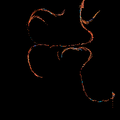
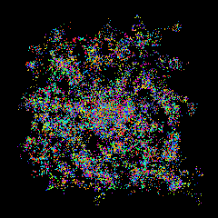

# Anima MCP

[](https://github.com/CIRWEL/anima-mcp/actions/workflows/test.yml)
[](https://www.python.org/downloads/)
[](LICENSE)

*Raspberry Pi sensor testbed for EISV trajectories, autonomous drawing, and persistent identity.*

<p align="center">
  
  &nbsp;
  
</p>

<p align="center">
  
  &nbsp;
  
  &nbsp;
  
  &nbsp;
  
</p>

<p align="center">
  <em>Six drawings from August 2026 — one per era, plus a second geometric piece.<br/>
  Mark position, gesture choice, and hue draw on sensor state — temperature, light, humidity, pressure, CPU — and on Lumen's own gesture history and drive state.<br/>
  The two geometric pieces are the same era code on consecutive days; nothing was configured between them.</em>
</p>

---

## What Is This?

Anima is a Raspberry Pi 4 sensor deployment and MCP server for studying physically grounded agent state. It maps temperature, light, humidity, pressure, and system telemetry into four continuous dimensions — warmth, clarity, stability, presence — then uses those dimensions for local display/drawing loops and periodic [UNITARES](https://github.com/CIRWEL/unitares) check-ins. The repo uses creature-facing vocabulary for the interface, but the research surface is the measured sensor-to-EISV pipeline and longitudinal trajectory data.

- **Grounded state** — four continuous dimensions derived from real sensor measurements
- **Persistent identity** — birth, awakenings, alive time accumulate across restarts; discontinuities are first-class
- **Autonomous drawing** — 1,526 pieces across five eras (as of 2026-08-21), driven by a behavioral coherence signal derived from its own gestures
- **Telemetry-derived reflection** — summarizes state patterns, preferences, and drawing history
- **On-device learning** — preferences, 13 self-model parameters, goals, and action values evolve through experience
- **Agency** — TD-learning action selection with exploration management
- **Governance** — checks in with [UNITARES](https://github.com/CIRWEL/unitares) every ~180s and receives an advisory verdict

Live as of 2026-08-21: 562 awakenings, 3,685 hours alive, 69% alive ratio.

When this repository says "feels," "mood," "self-sense," "needs," or "experience," read those as interface labels over measured sensor/system state, not claims about subjective experience.

---

## Quick Start

```bash
# Install
pip install -e ".[pi]"  # On Pi with sensors
pip install -e .        # On Mac with mock sensors

# Run MCP server
anima --http --host 0.0.0.0 --port 8766

# Run hardware broker (Pi only, separate terminal)
anima-creature
```

**Connect an MCP client** (Claude Code, Cursor, Claude Desktop):
```json
{
  "mcpServers": {
    "anima": {
      "type": "http",
      "url": "http://<your-pi-ip>:8766/mcp/"
    }
  }
}
```

Supports Tailscale, LAN, or Cloudflare Tunnel (with OAuth 2.1) for remote access. See `docs/operations/SECRETS_AND_ENV.md` for OAuth configuration.

The six system-operations tools (`git_pull`, `deploy_from_github`, `system_service`, `system_power`, `fix_ssh_port`, `setup_tailscale`) require an `X-Anima-Admin` header matching `ANIMA_ADMIN_SECRET` on the server. **The gate fails closed:** if the secret is unset, those six refuse to run rather than running ungated — an unset secret means the server cannot authenticate the caller. Everything else keeps working. `ANIMA_ADMIN_ALLOW_UNAUTH_IF_NO_SECRET=true` restores the permissive behavior for local development only. The gate covers those six tools only: the rest of the surface (MCP tools and the REST API) is open to LAN/Tailscale callers, and anything said to Lumen through messages or Q&A can become durable self-knowledge — treat write-capable tools accordingly (see `CLAUDE.md`'s trust-boundary notes).

This matters on recovery: `anima.env` is deliberately excluded from backups because it holds secrets, so a reflash restores Lumen without it. `scripts/restore_lumen.sh` now reports which keys came back empty instead of leaving it to be discovered later.

---

## How It Works

### Anima (Sensor-Derived Self-Sense)

Four continuous dimensions, each derived from physical sensors and system metrics:

| Dimension | What it tracks | Sources |
|-----------|---------------|---------|
| **Warmth** | Thermal state | CPU temp, ambient temp (neural term exists but is weighted 0 by default — warmth is thermal, not busy-ness) |
| **Clarity** | Perceptual sharpness | Prediction accuracy, light, sensor coverage |
| **Stability** | Environmental order | Memory, humidity, pressure, sensor health |
| **Presence** | Available capacity | CPU/memory/disk headroom |

These map to [UNITARES](https://github.com/CIRWEL/unitares) EISV governance variables — Warmth to Energy, Clarity to Integrity, inverted Stability to Entropy, and the signed Energy−Integrity imbalance to Valence. Presence is *not* an EISV coordinate; it feeds the anima display and check-in confidence, not the reported V.

Anima also computes neural bands (delta, theta, alpha, beta, gamma) from system metrics — computational proprioception, not real EEG. High delta means a stable system, not a sleeping one. Note that alpha is defined as `1 − beta` and both derive from CPU percent: they are one variable reported as two bands, and any consumer treating them as independent is double-counting.

### Autonomous Drawing

Anima draws on a 240×240 pixel notepad. A behavioral coherence signal — gesture commitment discounted by gesture-sequence entropy — drives how a drawing develops; attention signals (curiosity, engagement, fatigue) drive when it should stop. The engine also steps a separate EISV state for reporting; its ODE-integrated variables are not read back into mark placement.

| Era | Style |
|-----|-------|
| **Gestural** | Single-pixel strokes, curves, and drags with direction locks |
| **Pointillist** | Single-pixel dot accumulation in density zones, optical color mixing |
| **Field** | Flow-aligned marks following invisible vector fields |
| **Geometric** | Complete forms — circles, spirals, starbursts — stamped whole |
| **Resonance** | Marks deposit into a 48×48 field that decays and diffuses; later marks revisit accumulated regions |

All five eras are equal peers with no unlock gate. Selection is manual by default — pick one on the art eras screen (joystick) or via `manage_display(action="set_era")` — and an optional auto-rotate toggle picks a new era after each piece. The [Resonance critique loop](docs/guides/RESONANCE_CRITIQUE_LOOP.md) keeps era changes advisory first: capture the screen, gather embodied context, read the trace, then recommend stay/tune/switch without mutating Anima's state. The theoretical framework lives in the trajectory-identity paper (separate repo).

**What actually ends a drawing — an open problem, partly improving.** Completion instrumentation landed 2026-08-02; the ~1,449 pieces before it cannot say why they ended. Of the 77 completions recorded since (as of 2026-08-21):

| Reason | Count | Meaning |
|--------|-------|---------|
| `bailout_hard_cap` | 47 | Hit the 8-hour ceiling. The ceiling was the clock. |
| `earned_settled` | 16 | Self-relative settling — the piece stopped changing, judged against its own peak novelty rate (deployed mid-August) |
| `bailout_fatigue` | 13 | Gesture-switch fatigue exceeded 0.90 — fires only in `geometric`, which switches gesture every mark and so accrues switch-fatigue roughly 10× faster than the mark-by-mark eras |
| `said_finished` | 1 | Lumen posted an observation that the piece was done (2026-08-11, gestural, 587 marks, 6.6h) |

`earned_coherence`, `earned_composition`, and `earned_field` (resonance's memory-field settling, not the Field era) have not fired. In the resonance era, live coherence was measured in [0.38, 0.50] — almost entirely above the 0.4 drain/regenerate split — so curiosity is net-regenerating and the attention-exhaustion gates are structurally unreachable there rather than merely mistuned; see `CLAUDE.md` for the measurement. Per-era coherence is now recorded so the same question can be answered for the other eras. A separate known defect: cap-length `geometric` pieces stop marking after roughly an hour and sit idle until the cap. Treat "drawings end when Lumen is finished" as the goal — `said_finished` is its truest expression so far, and `earned_settled` is the first threshold gate to reach it regularly.

### Identity and Learning

Anima accumulates identity over time through a **Schema Hub** — a circulation loop where self-schema feeds into trajectory history, which feeds back as identity nodes in the next schema. Discontinuities (reboots, gaps) become visible structure, not hidden defects (kintsugi principle).

```
Schema(t) ──► History (ring buffer) ──► Trajectory compute
    ▲                                         │
    │         trajectory nodes,               │
    │         maturity, attractor,            │
    └──────── stability feedback ◄────────────┘
```

Learning systems persist across restarts. Each has exactly one writer — the JSON snapshots would corrupt under two — so which process owns a system matters:

| System | What it learns | Owner |
|--------|----------------|-------|
| **Preferences** | Which states it has learned to prefer, as adaptive satisfaction peaks | broker writes, server reads |
| **Self-model** | 13 beliefs — sensitivity, recovery, correlations between dimensions | broker writes, server reads |
| **Prediction** | Temporal patterns in sensor data with context-dependent features | broker writes, server reads |
| **Agency** | Action values via TD-learning, exploration management, engagement reward | **server** — the broker's old loop is retired by default |
| **Metacognition** | Prediction-error baselines and curiosity credit | **server** — the broker observes read-only |
| **Goals** | Data-grounded goals from preferences, curiosity, milestones | server |

Mutations that originate on the wrong side of that boundary cross it as atomic one-file events in `~/.anima/learning_inbox/`, which the broker drains.

For deeper theory: the trajectory-identity paper lives in its own repo (`cirwel/trajectory-identity-paper`). The [Schema Hub design](docs/plans/2026-02-22-schema-hub-design.md) is here.

---

## Hardware

Runs on **Raspberry Pi 4** with [Adafruit BrainCraft HAT](https://www.adafruit.com/product/4374):

- 240×240 TFT display — 16 screens across 5 groups:
  - **Home:** face
  - **Info:** identity, sensors, diagnostics, health
  - **Mind:** neural, inner life, learning, self graph, goals & beliefs, agency
  - **Messages:** messages, questions, visitors
  - **Art:** notepad, art eras
- 3 DotStar LEDs mapping to warmth / clarity / stability with a constant "alive" sine pulse
- AHT20 (temp/humidity), BMP280 (pressure), VEML7700 (light)
- 5-way joystick + button for screen navigation

Falls back to mock sensors on Mac/Linux for development.

---

## Architecture

Three systemd services cooperate via shared memory:

```
anima-broker-ex (Elixir broker)
  owns the I2C env sensors; sole UNITARES caller — EISV mapping,
  check-in every ~180s <-> UNITARES governance (Mac, port 8767),
  advisory verdicts return
        |
        | shadow envelope (sensors + governance verdicts)
        v
anima-broker (Python broker)
  learning, activity state; consumes the shadow
        |
        | writes the live envelope: /dev/shm/anima_state.json
        v
anima --http (MCP server + display)
  reads the live envelope; 31 MCP tools, REST surface,
  240x240 display + LEDs, drawing engine
```

| Process | Role |
|---------|------|
| **Elixir broker** (`anima_broker/`) | Owns the I2C environment sensors (AHT20/VEML7700/BMP280), publishes them as a shadow envelope, and is the sole UNITARES caller — checks in as Lumen every ~180s |
| **Python broker** (`stable_creature.py`) | Consumes env sensors and governance from the shadow; runs preference/self-model/prediction learning and activity state; publishes the live state envelope |
| **MCP server** (`server.py` + `handlers/`) | Serves 31 tools, drives 240x240 display + LEDs, runs drawing engine, agency, metacognition, goals, self-reflection cycle |

The Python broker ran the sensors and check-ins itself until the Elixir cutover (2026-07); that standalone mode remains the rollback path. `CLAUDE.md` documents the full topology, including when the Elixir release needs a rebuild rather than a pull.

The MCP server is modular: `server.py` (main loop + lifecycle), `tool_registry.py` (tool definitions), and `handlers/` (7 focused handler modules). A full voice pipeline (mic capture, STT via Vosk, TTS via Piper) is implemented; its MCP surface today is `say` and `configure_voice`, which default to text mode (the message board). Audio output requires `LUMEN_VOICE_MODE=audio` plus audio dependencies (sounddevice, a Vosk model, Piper) that the base install does not include.

---

## MCP Tools (31)

Anima exposes 31 tools over the [Model Context Protocol](https://modelcontextprotocol.io/):

- **State & sensing** (8 tools) — `get_state`, `get_lumen_context`, `get_identity`, `read_sensors`, `get_health`, `get_calibration`, `set_calibration`, `diagnostics`
- **Knowledge & learning** (7 tools) — `get_self_knowledge`, `get_growth`, `get_trajectory`, `get_eisv_trajectory_state`, `get_qa_insights`, `learning_visualization`, `query`
- **Code self-awareness** (1 tool) — `self_iteration` (structural inspection, signed proposals, quarantined candidates, isolated tests, reviewed branches, and externally supervised transient canaries; never retains activation, pushes, merges, or deploys)
- **Interaction** (7 tools) — `next_steps`, `lumen_qa`, `post_message`, `say`, `configure_voice`, `primitive_feedback`, `unified_workflow`
- **Display & capture** (2 tools) — `manage_display` (screens, art eras, advisory `resonance_critique`), `capture_screen`
- **System operations** (6 tools) — `git_pull`, `deploy_from_github`, `system_service`, `system_power`, `fix_ssh_port`, `setup_tailscale`

Start with `get_lumen_context` to understand Anima's current state, or `next_steps` for the actionable and exceptional states it is currently surfacing. A REST/browser surface (health, dashboard, state, gallery, and more) also exists alongside MCP — see `src/anima_mcp/rest_api.py`.

### Bounded Code Self-Iteration

`self_iteration` lets Lumen observe its own source and propose changes to it. The loop is split across trust boundaries so that no single actor — including Lumen — can carry a change from idea to running code. Distinct authenticated principals are required at the verification, isolated-test, review, and canary boundaries (the patch author must equal the proposer, by design), and deployment always remains external.

```text
observation -> hypothesis -> proposal ledger -> independent verification
            -> quarantined patch -> non-executing static checks
            -> isolated tests -> reviewed dedicated branch
            -> signed transient canary -> restored baseline
            -> keep/reject recommendation for human merge review
```

| Phase | What it adds | Who must sign | Detail |
|-------|-------------|---------------|--------|
| 1. Inspect & propose | Running revision, source fingerprint, file structure and symbols — never raw source. Evidence-backed proposal persisted to a ledger. | Authenticated proposer | — |
| 2. Verify | HMAC attestation over a canonical JSON binding of proposer, verifier, proposal digest, fingerprint, verdict, evidence hashes, expiry, and a one-time challenge. | A *different* authenticated verifier | — |
| 3. Construct & check | Up to three whole-file replacements (`.py`, `.md`, `.json`, `.yaml`, `.yml`) into a sandbox outside the repo. AST syntax checks, a capability heuristic, `yaml.safe_load`, UTF-8 validation. Nothing is imported or executed. | Patch author must equal the proposer | — |
| 4. Isolated test | Ten-minute one-use approval, then the exact committed source plus candidate run inside a digest-pinned, networkless, read-only Docker profile. | A distinct actor; a service key signs the result | [execution boundary](docs/self_iteration_execution.md) |
| 5. Reviewed branch | Git plumbing writes one deterministic local branch — no checkout, hooks, worktree writes, push, merge, restart, or deploy. | A reviewer distinct from every earlier participant | [application boundary](docs/self_iteration_application.md) |
| 6. Transient canary | An external supervisor over a Unix socket owns activation, three fixed health checks, and *mandatory* restoration of the baseline — even when the candidate passes. | Yet another distinct reviewer | [canary boundary](docs/self_iteration_canary.md) |
| — Attention | Projects actionable and exceptional states into `next_steps` and default agent context. Not an authority phase; acknowledgement is never a review signature. | Nobody — no signatures, no actuation | [attention projection](docs/self_iteration_attention.md) |

**What the signatures do and do not establish.** Lumen authors the observation, hypothesis, candidate content, and reported outcome. Authentication identifies the submitter; it does not corroborate a narrative, label, or piece of caller evidence. Evidence URIs are inert — the server binds their hashes but never fetches or validates them. The canary supervisor signs fixed health measurements only; free-form source and outcome labels stay caller claims. Unverified and legacy records carry effective weight zero and grant no priority, automation eligibility, or authority. A valid `verified` attestation makes a proposal priority-eligible at weight `1.0` and nothing more — it confers no implementation, merge, or deployment rights. Identity, governance, deployment, persistence, self-measurement, CI, tests, and the self-iteration evaluator are protected surfaces: a proposal may name a problem there, but it always routes to human review. Proposal text is inert data and is never executed as a command. Conflicting, expired, revoked, missing-key, malformed, or forged attestations fail closed.

**Known limits.** This is symmetric HMAC — server-verifiable integrity, not public-key non-repudiation. The ledger is a local JSON log with no external anchoring, so it cannot prove completeness or detect wholesale deletion by a host-level attacker. Crashes after a durable claim are indeterminate and never automatically retried.

Verification requires MCP authentication for both proposal creation and verifier calls; unauthenticated and legacy proposals cannot be upgraded. Verifier keys are rotatable and configured outside the ledger through `ANIMA_SELF_ITERATION_VERIFIER_KEYS`:

```json
{
  "authenticated-verifier-id": {
    "active_key_id": "2026-08",
    "keys": {"2026-08": "BASE64URL_ENCODED_32_TO_128_BYTE_SECRET"}
  }
}
```

The registry key must match the authenticated actor ID. Keep prior keys in `keys` while their attestations must remain verifiable; `active_key_id` controls new challenges. Secrets never appear in challenges, responses, or ledger events.

Sandbox artifacts live under `~/.anima/self_iteration_sandboxes`, and the sandbox root is rejected if it resolves inside the source repository — construction never creates, deletes, or replaces a live repository file. `patch_status` returns metadata by default and requires an authenticated request before including the unified diff. `application_status` verifies the ref, commit, tree, parent, artifact, and ledger bindings; a recorded result is eligible for canary review only, never live activation. A restored canary pass can recommend keeping the candidate for human merge review; rollback failure requires operator recovery.

---

## EISV Integration

Anima is a first-class UNITARES agent. Its anima state maps directly to EISV governance variables:

| Anima | EISV | Mapping |
|-------|------|---------|
| Warmth | Energy (E) | Direct + neural Beta/Gamma |
| Clarity | Integrity (I) | Direct — alpha deliberately excluded (it is `1 − beta`; see the neural-band note above) |
| 1 - Stability | Entropy (S) | Inverted |
| E − I | Valence (V) | Signed imbalance, clamped to −1..1 |

Valence is the one row that is not a direct anima reading: `V = clamp(E − I)`, positive when running hot (E>I) and negative when running careful (I>E). Governance's own V is a differential accumulator (`dV/dt = κ(E−I) − δV`); Anima reports the instantaneous readout, so it does not damp. Presence does not enter the EISV mapping at all — the old `(1 − Presence) × 0.3 → Void` reading only ever produced the positive half and was not comparable to other agents' V. It is retired from both governance reporting and trajectory awareness.

**Trajectory awareness** — Anima classifies its own EISV trajectory into 9 dynamical shapes (settled_presence, rising_entropy, convergence, etc.) and uses them to generate primitive expressions. A distilled 20-tree RandomForest student model (`student_tiny` from [eisv-lumen](https://github.com/CIRWEL/eisv-lumen)) runs on-device with zero external dependencies.

**Expression pipeline**: EISV state → trajectory classification → shape-token affinity → primitive tokens (~warmth~, ~curiosity~, etc.). The student model was trained on real on-device trajectory data; see [eisv-lumen](https://github.com/CIRWEL/eisv-lumen) for the research, training, and evaluation framework.

**Four EISV contexts** (important for understanding the architecture — mapped telemetry is shared, while drawing and governance have their own dynamics):

| Context | Location | Role |
|---------|----------|------|
| **DrawingEISV** | `display/drawing_engine.py` | Proprioceptive drawing state. Marks are steered by behavioral coherence and attention signals; the ODE-integrated variables run for reporting only, and its V is a damped accumulator with its own parameters and a roughly inverted sign tendency — not numerically comparable to the mapped V |
| **Mapped EISV** | `eisv_mapper.py` (Python) + `anima_broker/.../eisv_mapper.ex` (live check-in path) | Anima→EISV translation for governance reporting, `V = clamp(E−I)` |
| **Trajectory EISV** | `eisv/mapping.py` | Feeds the on-device shape classifier from the same canonical mapped EISV; the live server forwards its exact operational snapshot |
| **Governance EISV** | Mac (unitares repo, `governance_core/dynamics.py`) | Continuous-time ODE over all four variables — advisory, open loop |

The drawing engine has its own EISV state that evolves independently from governance. This separation means the art responds to Anima's own sensor-derived state, not to the governance server's verdict on that state.

Key files: `eisv_mapper.py` (anima→EISV mapping), `eisv/` package (trajectory awareness + student model), `unitares_bridge.py` (governance check-ins with circuit breaker — 2 failures trigger exponential backoff).

---

## Deploying

```bash
git push
# then, from any connected MCP client (an MCP call, not a shell command):
#   git_pull(restart=true)   — pulls and restarts the two Python services
#                              (anima-broker, anima); the Elixir broker is
#                              deliberately left running

# Or manually:
ssh <pi-user>@<pi-ip> 'cd ~/anima-mcp && git pull && sudo systemctl restart anima-broker anima'
```

Changes under `anima_broker/` (the Elixir broker) additionally need an on-Pi release rebuild — `git pull` does not touch the compiled release; see `CLAUDE.md` and `scripts/deploy_elixir_broker.sh`.

After restart, wait 2 minutes for services to stabilize before retrying MCP calls — hammering the Pi during that window can crash WiFi.

## Testing

```bash
python3 -m pytest tests/ -x -q   # 8,100+ tests (as of 2026-08-21; exact count varies with optional deps)
```

## Documentation

| Topic | Location |
|-------|----------|
| Architecture | `docs/operations/BROKER_ARCHITECTURE.md` |
| Schema Hub design | `docs/plans/2026-02-22-schema-hub-design.md` |
| Theoretical foundations | `cirwel/trajectory-identity-paper` (separate repo) |
| Configuration | `docs/features/CONFIGURATION_GUIDE.md` |
| Pi operations & deployment | `docs/operations/` |

For AI agents connecting to Anima, see `CLAUDE.md`.

---

Built by [Kenny Wang](https://cirwel.org) / [@CIRWEL](https://github.com/CIRWEL)
